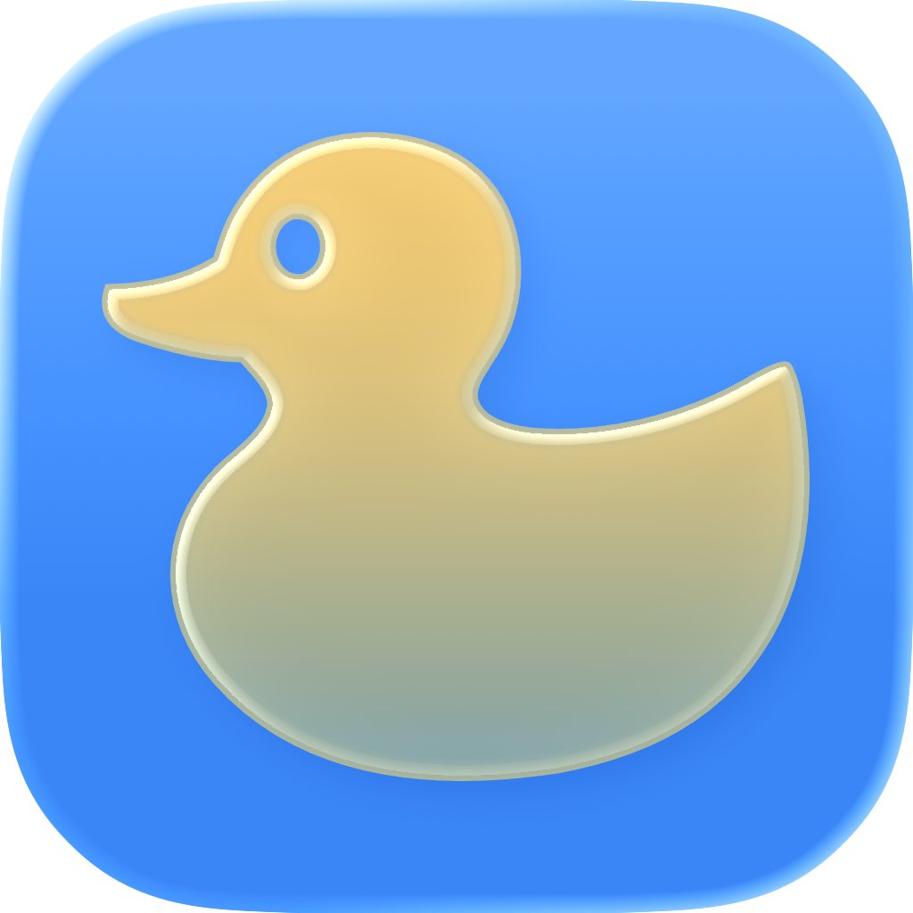

<p align="center">
  
</p>

<h1 align="center">Rubber Duck</h1>

<p align="center">
  Voice coding agent for macOS. Hold a hotkey, speak to your codebase, hear answers back.
</p>

## How it works

Hold `Option+D` and speak. The agent reads your files, edits code, runs commands, and talks back — all streamed to your terminal via the `duck` CLI.

Interrupt mid-sentence and it stops immediately. Nothing is hidden.

## Install

Requires macOS 15.2+ and an [OpenAI API key](https://platform.openai.com/api-keys).

```bash
brew tap mblode/tap
brew install --cask rubber-duck
```

Or [download the latest DMG](https://github.com/mblode/rubber-duck/releases/latest) directly.

The `duck` CLI installs automatically on first launch.

## Usage

```bash
duck ~/projects/myapp          # attach a workspace and stream events
duck say "fix the auth bug"    # send a typed message
duck sessions                  # list sessions
duck doctor                    # check system health
```

## Updates

- Direct downloads: **Check for Updates…** in Settings
- Homebrew: `brew upgrade --cask rubber-duck`

## Troubleshooting

- Menu bar icon hidden? Press `Option+Shift+D` to open Settings directly
- `duck` commands hanging? Run `duck doctor` or restart with `pkill -f duck-daemon`

## License

[MIT](LICENSE.md)
